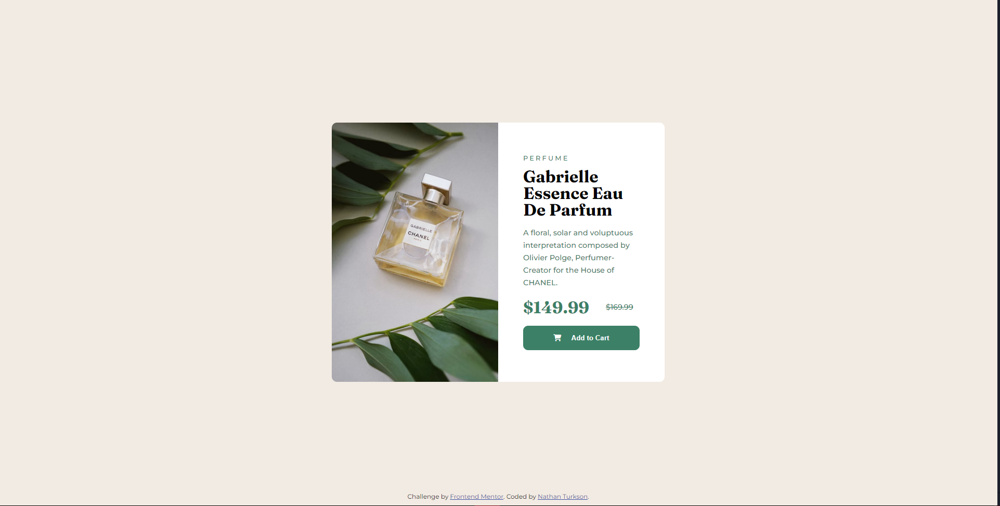

# Frontend Mentor - Product preview card component solution

This is a solution to the [Product preview card component challenge on Frontend Mentor](https://www.frontendmentor.io/challenges/product-preview-card-component-GO7UmttRfa). Frontend Mentor challenges help you improve your coding skills by building realistic projects. 

## Table of contents

  - [Screenshot](#screenshot)
  - [Links](#links)
  - [My process](#my-process)
  - [Built with](#built-with)
  - [What I learned](#what-i-learned)
  - [Author](#author)

**Note: Delete this note and update the table of contents based on what sections you keep.**

### Screenshot

### Links

- Live Site URL: [here](https://nathan-codes.github.io/qr-code-component-main/)

### Built with

- Semantic HTML5 markup
- CSS custom properties
- Flexbox
- Google Fonts
- Responsive Design 

### What I learned

I learnt the importance of understanding and working with the css box model and media queries.

## Author

- Website - [Nathan Turkson](https://www.your-site.com)
- Frontend Mentor - [@nathan-codes](https://www.frontendmentor.io/profile/nathan-codes)
- Twitter - [@nathan_turkson](https://www.twitter.com/NathanTurkson)

**Note: Delete this note and add/remove/edit lines above based on what links you'd like to share.**